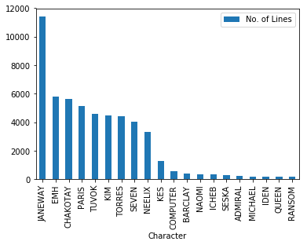
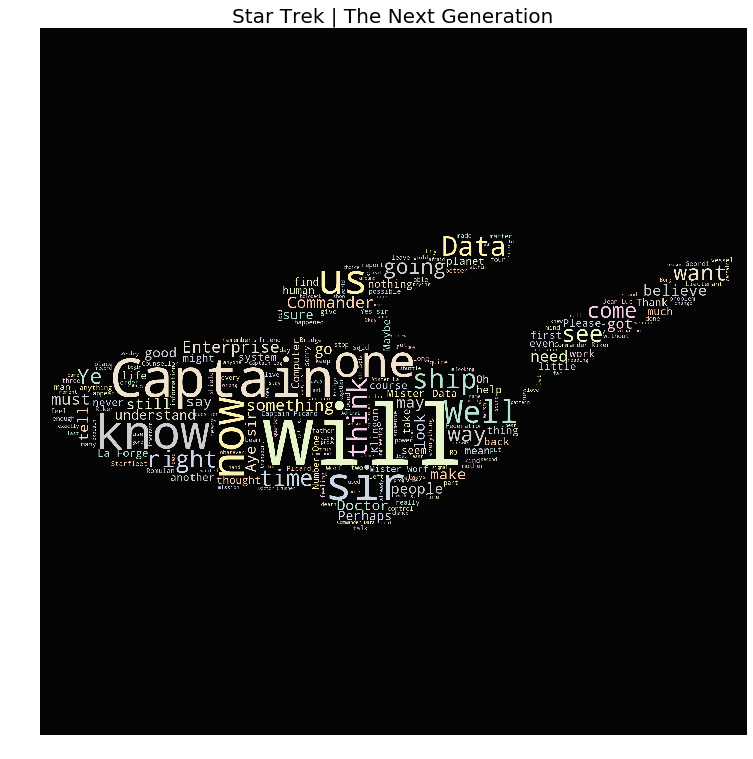
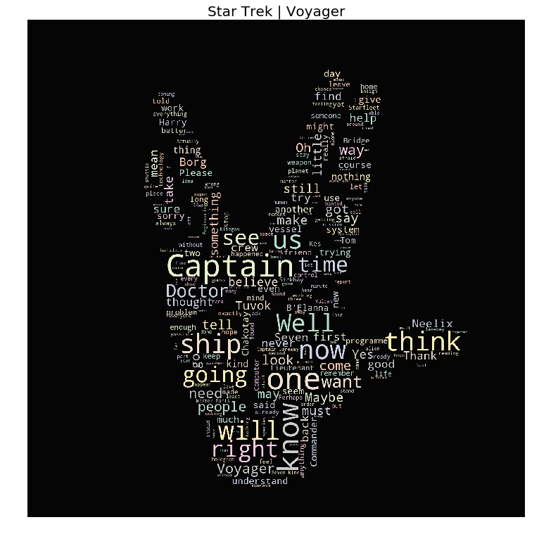
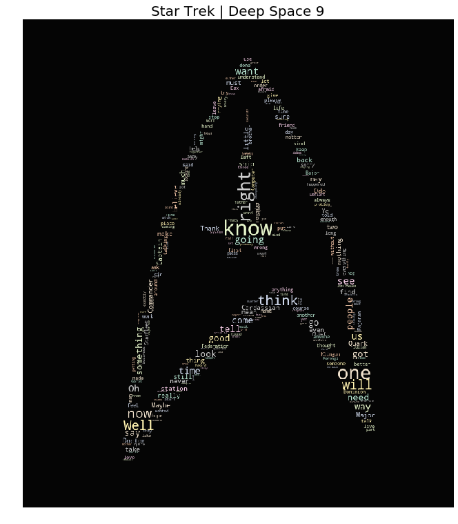

# Star Trek WordClouds

After watching a few episodes of Voyager the other day, I decided to go on a hunt for Star Trek projects on Kaggle (this may or may not be the nerdiest sentence I've written to date). I found some small beginnings of projects, but nothing notably extensive. I found https://www.kaggle.com/gjbroughton/start-trek-scripts which was a nice beginning, so I decided to build off of what was in Gary's corresponding GitHub repo https://github.com/GJBroughton/Star_Trek_Scripts. 

Gary wrote some web scraping code to grab all the text from all the episodes of Star Trek across each series, and by each character, from the website http://www.chakoteya.net/StarTrek/index.html. Gary also wrotesome data cleansing code that I will use. Thanks, Captain Gary!

Let's take a look at Gary's code, peek at the text that's pulled down, and see what we can do about some wordclouds, to see what words are emphasized in different Star Trek series.

Engage!

## First, Captain Gary's Scraping Code.


```python
#import all them necessary packages
import requests
import pandas as pd
from bs4 import BeautifulSoup
import string
import re
import nltk
import json
import matplotlib.pyplot as plt
```


```python
#create functions for getting links and processing/cleaning text

def get_text(url):
    response = requests.get(url)
    content = response.content
    parser = BeautifulSoup(content,'html.parser')
    return(parser.text)

def clean_text(script):
    script_clean=script.strip()
    script_clean=script_clean.replace("\n","")
    script_clean=script_clean.replace("\r"," ")
    script_clean=script_clean.replace("\r\n","")
    script_clean=re.sub("([\(\[]).*?([\)\]])", "", script_clean)
    script_clean=re.sub(r'\.([a-zA-Z])', r'. \1', script_clean) #remove whitespace between character lines.
    script_clean=re.sub(r'\!([a-zA-Z])', r'! \1', script_clean)
    script_clean=re.sub(r'\?([a-zA-Z])', r'? \1', script_clean)
    return(script_clean)

def get_cast(script_clean):
    tokens=nltk.word_tokenize(script_clean)
    cast=[]
    for word in tokens:
        if re.search("\\b[A-Z]{3,}\\b", word) is not None:
            cast.append(word)
    return(list(set(cast)))

def get_lines(script_clean, cast):
    split_script=script_clean.split(':')
    lines_dict=dict.fromkeys(cast)
    for cast_member in cast:
        lines=[]
        for i in range(len(split_script)-1):
            if cast_member in split_script[i].strip().split(" "):
                line=split_script[i+1].strip().split(" ")
                line=[word for word in line if word != '']
                for member in cast:
                    if member in line:
                        line.remove(member)
                line=' '.join(line)
                lines.append(line)
        lines_dict[cast_member]=lines

    return(lines_dict)

#function for grabbing all the links to all the different webpages that include text we want to analyze

def get_page_links():
    top_links=["http://www.chakoteya.net/DS9/episodes.htm", 
                   "http://www.chakoteya.net/StarTrek/episodes.htm", 
                   "http://www.chakoteya.net/NextGen/episodes.htm", 
                   "http://www.chakoteya.net/Voyager/episode_listing.htm", 
                   "http://www.chakoteya.net/Enterprise/episodes.htm"]
    short_links=["http://www.chakoteya.net/DS9/", 
                   "http://www.chakoteya.net/StarTrek/", 
                   "http://www.chakoteya.net/NextGen/", 
                   "http://www.chakoteya.net/Voyager/", 
                   "http://www.chakoteya.net/Enterprise/"]
    links_list=[]
    names_list=[]
    for i, link in enumerate(top_links):
        response = requests.get(link)
        content = response.content
        parser = BeautifulSoup(content,'html.parser')
        urls = parser.find_all('a')
        for page in urls:
            links_list.append(short_links[i]+str(page.get('href')))
            name=page.text
            name=name.replace('\r\n',' ')
            names_list.append(name)
            
    
    links_to_remove=['http://www.chakoteya.net/Voyager/fortyseven.htm',
                     'http://www.chakoteya.net/Voyager/LineCountS1-S3.htm',
                     'http://www.chakoteya.net/Voyager/LineCountS4-S7.htm',
                     'http://www.chakoteya.net/Enterprise/fortyseven.htm',
                    ]
    links_list=[link for link in links_list if (link.endswith('.htm')) & (link not in links_to_remove)]
    
    return(links_list)


page_links=get_page_links()

#break page links apart by series

DS9_links = page_links[0:173]
TOS_links = page_links[173:253]
TAS_links = page_links[253:275]
TNG_links = page_links[275:451]
VOY_links = page_links[451:611]
ENT_links = page_links[611:]

#create lists of abbreviations to assign to the link list breakouts for each series
links_names=['DS9', 'TOS', 'TAS', 'TNG', 'VOY', 'ENT']
links=[DS9_links, TOS_links, TAS_links, TNG_links, VOY_links, ENT_links]

all_series_scripts={}
for i,series in enumerate(links):
    series_name=str(links_names[i])
    print(series_name)
    all_series_scripts[series_name]={}
    episode_script={}
    all_cast=[]
    for j,link in enumerate(series):
        episode="episode "+str(j)
        text=get_text(link)
        episode_script[episode]=text
    all_series_scripts[series_name]=episode_script

with open('all_scripts_raw.json', 'w') as data:
    json.dump(all_series_scripts, data)

with open('all_scripts_raw.json', 'r') as data:
    all_scripts_raw = json.load(data)

all_series_lines={}
for i,series in enumerate(links_names):
#    print(series)
    series_name=str(links_names[i])
    all_series_lines[series_name]={}
    all_lines_dict={}
    all_cast=[]
    for j,episode in enumerate(all_scripts_raw[series]):
        script=all_scripts_raw[series][episode]
        cleaned_script=clean_text(script)
        cast=get_cast(cleaned_script)
        for member in cast:
            if member not in all_cast:
                all_cast.append(member)
        lines_dict=get_lines(cleaned_script,all_cast)
        all_lines_dict[episode]=lines_dict
    all_series_lines[series]=all_lines_dict

with open('all_series_lines.json', 'w') as data:
    json.dump(all_series_lines, data)

with open('all_series_lines.json', 'r') as data:
    all_series_lines = json.load(data)
```

    DS9
    TOS
    TAS
    TNG
    VOY
    ENT


## Analysis | Descriptive Stats

Gary wrote some initial code to get counts of all lines spoken by each character in a given series. He has DS9 as the default, but since I'm in the middle of Voyager, let's take a look at counts from that series instead.


```python
episodes=all_series_lines['VOY'].keys()

total_lines_counts={}
line_counts_by_episode={}
for i,ep in enumerate(episodes):
    episode="episode "+str(i)
    line_counts_by_episode[episode]={}
    for member in list(all_series_lines['VOY'][ep].keys()):
        line_counts_by_episode[episode][member]=len(all_series_lines['VOY'][ep][member])
        if member in total_lines_counts.keys():
            total_lines_counts[member]=total_lines_counts[member]+len(all_series_lines['VOY'][ep][member])
        else:
            total_lines_counts[member]=len(all_series_lines['VOY'][ep][member])

#print(total_lines_counts)
#print("")
#print(line_counts_by_episode)

series_df=pd.DataFrame(list(total_lines_counts.items()), columns=['Character','No. of Lines'])
Top20=series_df.sort_values(by='No. of Lines', ascending=False).head(20)

Top20.plot.bar(x='Character',y='No. of Lines')
plt.show()
```





Looks like Captain Janeway is one verbose leader! I always thought of her as more of a strong, silent type, but here I am, rendered incorrect by the data (my most favorite way to be incorrect). The rest of the characters start clocking counts at almost half of Janeway's, with the Emergency Medical Hologram (The Doctor) in second, and Commander Chakotay in third.

I'll be honest in saying that since our dataset at hand is more recreational than anything, this histogram leaves much to be desired. Frequency charts can be a little more fun, so let's have it, let's get on with some fun.

WordClouds

While looking into some NLP kernels, I spotted a pretty interesting wordcloud focused Kaggle kernel that took images and created wordclouds from the outlines of the images:
https://www.kaggle.com/arthurtok/spooky-nlp-and-topic-modelling-tutorial

Using a bit of the code from this kernel, let's have some fun with the text at hand.


```python
#import the necessary libraries
from wordcloud import WordCloud, STOPWORDS
import codecs
import base64
import imageio
import plotly
import re
```

After importing all of the necessary packages we need for this little project, we need to take three images that we want to overlay wordclouds onto, and convert them to Base64. To do this, I'm using the base64 package in python.


```python
with open('/Users/tricia/Documents/GitHub/StarTrek/images/USSEnterprise.jpg', 'rb') as imageFile:
    USSEnterprise_64 = base64.b64encode(imageFile.read())

with open('/Users/tricia/Documents/GitHub/StarTrek/images/StarTrekLogo.jpg', 'rb') as imageFile:
    StarTrekLogo_64 = base64.b64encode(imageFile.read())

with open('/Users/tricia/Documents/GitHub/StarTrek/images/VulcanSalute5.jpg', 'rb') as imageFile:
    DS9_64 = base64.b64encode(imageFile.read())
```

We then assign the images to a mask object, that will be passed into the WordCloud generator.


```python
# Generate the Mask for EAP
f1 = open('/Users/tricia/Documents/GitHub/StarTrek/images/USSEnterprise.jpg', 'wb')
f1.write(codecs.decode(USSEnterprise_64,'base64'))
f1.close()
img1 = imageio.imread('/Users/tricia/Documents/GitHub/StarTrek/images/USSEnterprise.jpg')
# img = img.resize((980,1080))
stmask = img1

f2 = open('/Users/tricia/Documents/GitHub/StarTrek/images/StarTrekLogo.jpg', 'wb')
f2.write(codecs.decode(StarTrekLogo_64,'base64'))
f2.close()
img2 = imageio.imread('/Users/tricia/Documents/GitHub/StarTrek/images/StarTrekLogo.jpg')
stmask2 = img2

f3 = open('/Users/tricia/Documents/GitHub/StarTrek/images/VulcanSalute5.jpg', 'wb')
f3.write(codecs.decode(DS9_64,'base64'))
f3.close()
img3 = imageio.imread('/Users/tricia/Documents/GitHub/StarTrek/images/VulcanSalute5.jpg')
stmask3 = img3;
```

We've got our images all ready to go, so now we need to prepare our data. Our data is currently stored in a dictionary of dictionaries: each dictionary within the main all_series_lines dictionary is a series, and within each series dictionary is another dictionary that stores all of episodes. Within the episodes dictionaries are then dictionaries of lists containing all of the lines said by each character. It's like a set of Russian Dolls for Star Trek fans.

For this exercise, I'm going to focus on my three favorite series: TNG, VOY, and DS9. For TNG, I found an image of the USS Enterprise to create a WordCloud with. For VOY, I found an image of a Vulcan Salute. For DS9, I decided to try using a Star Trek logo.

Disclaimer: You'll notice if you look closely that the VulcanSalute5.jpg image is assigned to the DS9_64 base64 image and the stmask3, but please don't be distracted by this. Plotting WordClouds with image masks is a bit finicky, and I assigned the Vulcan image to DS9 without thinking about it, simply because I was testing a bunch of images to see what worked, realizing only after I finally got the whole thing to run that there aren't any main Vulcan characters in the DS9 series. Silly me. I re-assigned the DS9 image to use the stmask2 mask instead. Crisis averted.


```python
#seperate lines by series
tng = all_series_lines['TNG']
voy = all_series_lines['VOY']
ds9 = all_series_lines['DS9']
```


```python
tng_lines = []
for ep in list(tng.keys()):
    episode = tng[ep]
    for x in list(episode.keys()):
        lines = episode[x]
        tng_lines.append(lines)      
tng_lines=[item for sublist in tng_lines for item in sublist]
tng_lines=' '.join(tng_lines)


voy_lines = []
for ep in list(voy.keys()):
    episode = voy[ep]
    for x in list(episode.keys()):
        lines = episode[x]
        voy_lines.append(lines)      
voy_lines=[item for sublist in voy_lines for item in sublist]
voy_lines=' '.join(voy_lines)


ds9_lines = []
for ep in list(ds9.keys()):
    episode = ds9[ep]
    for x in list(episode.keys()):
        lines = episode[x]
        ds9_lines.append(lines)      
ds9_lines=[item for sublist in ds9_lines for item in sublist]
ds9_lines=' '.join(ds9_lines)
```

Below is the code used to plot the WordClouds. I played with different parameters, decreasing the max_words to 150, and increasing the max_font_size to 250, to help words "pop" a little more. I also made sure to remove the stopwords (is, as, a, the, etc.).

The plots look pretty cool, but trying to analyze the most used words (the largest) doesn't really render much insight. If I do this exercise by splitting out each captain's lines or other characters, we might see something more interesting. At this point, however, I'm signing off and heading to the holodeck for some R&R (and by that I mean I'm shutting off my computer and will probably watch an episode of the Great British Baking Show).


```python
#tng plot
plt.figure(figsize=(16,13))
wc = WordCloud(background_color="black", max_words=250, 
               mask=stmask, stopwords=STOPWORDS, max_font_size= 250)
wc.generate(tng_lines)
plt.title("Star Trek | The Next Generation", fontsize=20)
# plt.imshow(wc.recolor( colormap= 'Pastel1_r' , random_state=17), alpha=0.98)
plt.imshow(wc.recolor( colormap= 'Pastel2' , random_state=17), alpha=0.98)
plt.axis('off')

#voy plot
plt.figure(figsize=(16,13))
wc = WordCloud(background_color="black", max_words=250, 
               mask=stmask3, stopwords=STOPWORDS, max_font_size= 250)
wc.generate(voy_lines)
plt.title("Star Trek | Voyager", fontsize=20)
# plt.imshow(wc.recolor( colormap= 'Pastel1_r' , random_state=17), alpha=0.98)
plt.imshow(wc.recolor( colormap= 'Pastel2' , random_state=17), alpha=0.98)
plt.axis('off')

#ds9 plot
plt.figure(figsize=(16,13))
wc = WordCloud(background_color="black", max_words=250, 
               mask=stmask2, stopwords=STOPWORDS, max_font_size= 250)
wc.generate(ds9_lines)
plt.title("Star Trek | Deep Space 9", fontsize=20)
# plt.imshow(wc.recolor( colormap= 'Pastel1_r' , random_state=17), alpha=0.98)
plt.imshow(wc.recolor( colormap= 'Pastel2' , random_state=17), alpha=0.98)
plt.axis('off')
```


    (-0.5, 793.5, 898.5, -0.5)











It can also be centered!

{: .center-block :}
